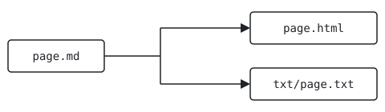

## Name

links and images - targets from the site root, and figures beside the page

A link names its target from the site root and the build makes it
relative to the page, so the same line works on every page, however
deep. An image does the opposite: its path starts from the page's own
folder, so it can sit beside the page. The links below are live; the
image is described, source and output.

[TOC]

## Link targets

`[label](target)` is a link. Write an internal target from the site
root, without a leading slash and without `.html`:

| Target | Leads to |
|---|---|
| `docs/guide` | a page, `/docs/guide` |
| `blog/` | a folder's page, `/blog/`: keep the trailing slash |
| empty, or `./` | the landing page of the language |
| `docs/guide/writing#links` | a section of another page |
| `./#<id>` | a section of the landing page |
| `#link-targets` | a section of this page |
| `logo.svg`, `blog/feed.xml` | a file: any last segment with an extension |
| `https://example.org/` | another site, left as written |

```text
The [guide](docs/guide), the [blog](blog/), [home](./), the
[links section of writing pages](docs/guide/writing#links),
[this section](#link-targets) and the [logo](logo.svg).
```

> The [guide](docs/guide), the [blog](blog/), [home](./), the
> [links section of writing pages](docs/guide/writing#links),
> [this section](#link-targets) and the [logo](logo.svg).

This page is `/docs/reference/markdown/links-and-images`, so the build
writes the first link as `../../guide`, and the same source on the
landing page as `docs/guide`. A target starting with `http` is left
untouched, and so is a target starting with `#`. Links are not checked
by the build: a target that leads nowhere is written all the same.

A section's anchor is its id, made from its title or set with `{#id}`
([sections](docs/reference/markdown/sections#ids)).

## Across languages

On a site with several languages, a page target stays in the language of
the page it is on: `docs/guide` from a French page leads to
`/fr/docs/guide`. A target starting with `/` is taken from the site
root as it is, and leaves the language:

```text
Read this page [in English](/docs/reference/markdown/links-and-images)
or [in French](/fr/docs/reference/markdown/links-and-images).
```

> Read this page [in English](/docs/reference/markdown/links-and-images)
> or [in French](/fr/docs/reference/markdown/links-and-images).

A file is written once, at the site root, and every language links the
same one. RSS feeds are the exception: one is written per language, but
`blog/feed.xml` in a page is a file target, so it is the default
language's feed; write `/fr/blog/feed.xml` for the French one
([languages](docs/guide/languages)).

## Other sites

A target starting with `http` is a link to another site. End its label
with the north-east arrow, U+2197, the sign that the link leaves the
site: screen readers skip the arrow and hear `labels.external` instead.

```text
The [example site ↗](https://example.org/) is not part of this one.
```

> The [example site ↗](https://example.org/) is not part of this one.

Whether such links open a new tab is set once for the whole site, in
`site.toml`: `[links] new_tab = true` sends every external link to a new
tab, except those to the hosts listed in `same_tab` and their
subdomains; a link that opens a new tab says so to screen readers first,
with `labels.new_tab`. The defaults are `new_tab = false` and
`same_tab = []` ([writing pages](docs/guide/writing#links)).

In the text mirror, an internal link keeps only its label, since a
terminal reader follows it with `curl`, not by copying it. An external
link prints its address in parentheses after the label, the arrow
dropped: `example site (https://example.org/)`.

## Images

An image is a block of its own: a single line, with blank lines around.
The alternative text goes in the brackets, the path in the parentheses,
and an optional caption in double quotes after the path.

```text

```

- The path is **relative to the page's folder**, unlike a link: put the
  image next to the page. For a post, make the post a folder,
  `blog/2026-01-01-hello/index.md`, with the image inside.
- The alternative text is required: it is what a screen reader says and
  what the text mirror shows.
- The caption may hold inline markup. The path may not hold a space.
- An image from another site, `https://example.org/map.png`, is allowed
  by the syntax, but the recommended server policy only lets pages load
  images from their own site: it will not display
  ([deployment](docs/guide/deployment)).

On the web page, the image is a `<figure>`: the image at its natural
size, never wider than the column, its `width` and `height` read from the
file (PNG, JPEG, GIF, WebP or SVG) so the page does not jump while it
loads, lazy loading, and the caption in a `<figcaption>`. In the text
mirror, the alternative text follows the `labels.image` word, then the
caption and the image's path from the site root, for `curl`:

```text
[ image ] A page's two outputs, HTML and text
  One source, two renderings.
  /blog/2026-01-01-hello/flow.svg
```

The build warns, and goes on, when the file is missing or the
alternative text is empty:

```text
warning: image not found: content/blog/2026-01-01-hello/flow.svg
warning: image without alt text: blog/2026-01-01-hello/flow.svg
```

Prefer SVG for diagrams: line art stays sharp at any size, and an SVG
file may carry its own dark-mode colours, in a
`@media (prefers-color-scheme: dark)` block. The recommended server
policy lets an SVG file style itself, never run a script. The images of
link previews are a separate matter, set in the front matter
([feeds and images](docs/reference/feeds-and-images)).

## See also

- [writing pages](docs/guide/writing)
- [languages](docs/guide/languages)
- [inline markup](docs/reference/markdown/inline)
- [the text mirror](docs/reference/text-mirror)
